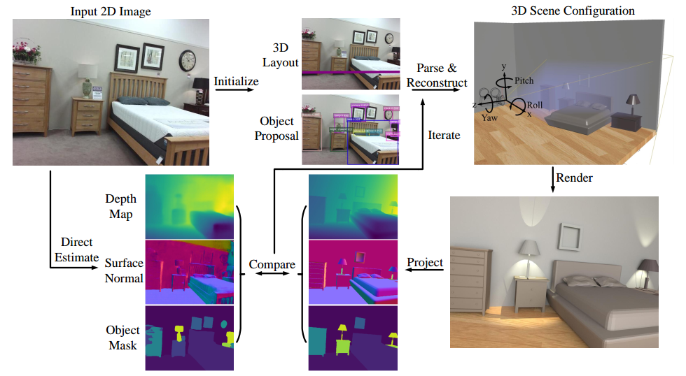

# Holistic 3D Scene Understanding and Reconstruction from a Single RGB Image

Created by <a href="http://www.siyuanhaung.com" target="_blank">Siyuan Huang</a>,
					<a href="http://web.cs.ucla.edu/~syqi/" target="_blank">Siyuan Qi</a>,
					<a href="http://www.yzhu.io/" target="_blank">Yixin Zhu</a>,
					<a href="http://yolandaxiao.com/" target="_blank">Yinxue Xiao</a>,
					<a href="http://web.cs.ucla.edu/~yuanluxu/" target="blank">Yuanlu Xu</a>, and
					<a href="http://www.stat.ucla.edu/~sczhu/" target="blank">Song-Chun Zhu</a> from UCLA

## Introduction

This repository contains the code for our ECCV 2018 paper (https://arxiv.org/abs/1808.02201). 

In this work, we propose a computational framework to jointly parse a single RGB image and reconstruct a holistic 3D configuration composed by a set of CAD models using 
a stochastic grammar model. We solve this joint parsing and reconstruction problem in an analysis-by-synthesis fashion, 
seeking to minimize the differences between the input image and the rendered images generated by our 3D representation, over the space of depth, surface normal, 
and object segmentation map. The optimal configuration, represented by a parse graph, is inferred using Markov chain Monte Carlo.

Please refer to our <a href="https://arxiv.org/abs/1808.02201"> Paper </a>for more details.

## Citation

If you find our work inspiring or our code helpful in your research, please consider citing:

    @inProceedings{huang2018holistic, 
      title={Holistic 3D Scene Parsing and Reconstruction from a Single RGB Image},
      author = {Huang, Siyuan and Qi, Siyuan and Zhu, Yixin and Xiao, Yinxue and Xu, Yuanlu and Zhu, Song-Chun},
      booktitle={ECCV},
      year={2018}
    }

## Install 
1.   pip install -r requirments.txt

2.   Install osmesa (offscreen rendering) and set up the environment following the instruction at <a href="https://github.com/thusiyuan/holistic_scene_parsing/blob/master/osmesa/osmesa.md">osmesa/osmesa.md</a>

## Data
1. Download initialized parse graph of 1,000 images and learned prior knowledge from <a href="https://drive.google.com/file/d/12GQXopA4IC8VCkbAz24ZpHv0Pbhu5EMs/view?usp=sharing"> here </a>, extract it with

        tar -vzxf data.tar.gz       

* Note we simplified the original CAD model in ShapeNetSem since the surface normal of some original models are flipped, this may hurt the performance a little bit.

## Inference

1. Joint inference of 3D room layout and 3D objects for sample, for example
    
        python inference.py -lo 11
        
* Inference takes about one hour for each image, we are working on accelerating the rendering process.
        
2. Infer latent human context and then joint infer layout, objects and human. Before that, you need to infer 3D room layout and 3D objects first or download our generated <a href="https://drive.google.com/file/d/13o3HSkmW_rOl1Mo3w6XIlbzQI1Aj6LQi/view?usp=sharing">results</a>. For example, 

        python inference.py -human 241
        
* Note we only infer the latent human context in the subset of office due to limited data in 3D human-object interaction. 

3. Sample possible human skeleton for a scene.

        python sample_human 241
## License

Our code is released under the MIT license.

